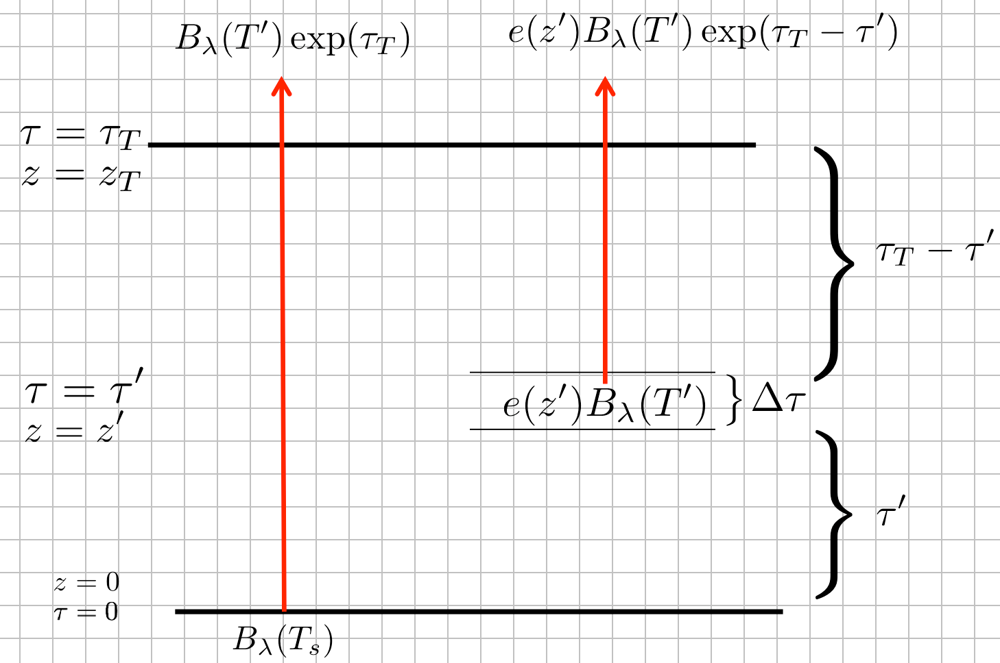
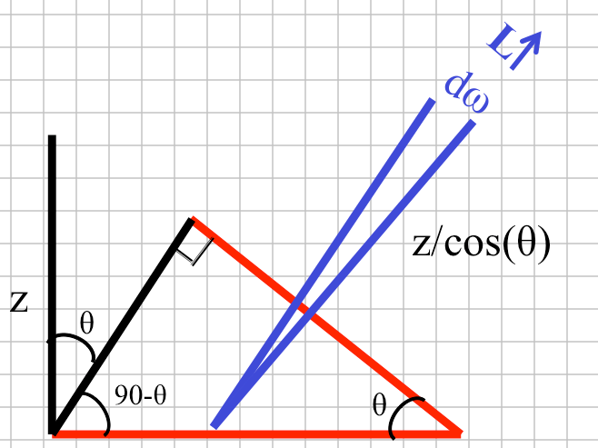
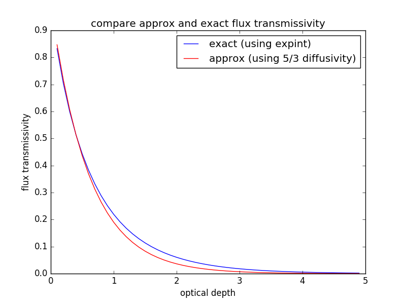

.. _heating_rate:

Finding the heating rate of the atmosphere
++++++++++++++++++++++++++++++++++++++++++

Review
======

Recall the derivation of :ref:`schwartz`, especially the section :ref:`weightfuns`.
The main result of that section was the expression for the radiance emitted from an
atmosphere of thickness :math:`\tau_T` over a black surface emitting radiance
:math:`B_\lambda(T_{skin}` and a temperature profile :math:`T(z)` that varies with height:

.. math::
   :label: main

      L_\lambda(\tau_T)= B_\lambda(T_{skin}) \exp(-\tau_T) +    \int_0^{\tau_T} B_\lambda(T)\, d\hat{t}

where :math:`\exp(-\tau_T)` is the total transmissivity of an atmosphere with optical thickness :math:`\tau_T` and :math:`\hat{t}` is the transmissivity of the atmosphere from the top of the atmosphere (where the optical depth=0, to a height at which the optical depth= :math:`\tau`.

Here's the picture:

If :math:`T` is constant with height then integrating :eq:`main` is simple:

.. math::
   :label: main2

     \begin{aligned}
         L_\lambda(\tau_T) &= B_\lambda(T_{skin}) \exp(-\tau_T) +    B_\lambda(T) \int_0^{\tau_T} \, d\hat{t}\\
           &= B_\lambda(T_{skin}) \exp(-\tau_T) +    B_\lambda(T)(\hat{t}(\tau_T) - \hat{t}(0) ) \\
           &= B_\lambda(T_{skin}) \exp(-\tau_T) +    B_\lambda(T)(1 - \exp(-\tau_T) )
     \end{aligned}

Slant paths
===========

As we noted in :ref:`schwartz`, :eq:`main2` is limited to (straight) upward radiance, with :math:`\cos(\theta)=0`
The more general situation is discussed in :ref:`moving`, where this figure shows that radiation coming
in at a zenith angle of :math:`\theta` travels farther than a straight vertical path by a factor of
:math:`1/\cos\theta`.

To avoid continually having to write :math:`\cos \theta` everywhere, it's common to make the substitution :math:`\mu = \cos \theta`, :math:`d\mu = -\sin \theta d\theta`.

In this case we need to increase the optical thickness by that amount, so that :eq:`main2` becomes

.. math::
   :label: main3

     \begin{aligned}
         L_\lambda(\tau_T/\mu) &=
           &= B_\lambda(T_{skin}) \exp(-\tau_T/\mu) +    B_\lambda(T)(1 - \exp(-\tau_T/\mu) )
     \end{aligned}

Net flux
========

If we want to know whether the atmosphere is heating or cooling at a particular place, however, we need
to convert the monochromatic radiance :math:`L_\lambda` into the corresponding broadband flux :math:`E` by:

1) Integrating :math:`\cos \theta L_\lambda d\omega` over a hemisphere to get the monochromatic flux :math:`E_\lambda`
   as in :ref:`moving` equation (1):

   .. math::
     :label: fluxrel

     \begin{aligned}
     E_{\lambda \uparrow} &= \int dE_\lambda = \int_0^{2\pi} \int_0^{\pi/2} \cos \theta \, L_\lambda \, d \omega =\int_0^{2\pi} \int_0^{\pi/2} L_\lambda \cos \theta  \sin \theta \, d\theta \ \, d \phi  \\
     &= \int_0^{2\pi} \int_0^1 L_\lambda  \mu d \mu\ \, d \phi
     \end{aligned}

   where the arrow :math:`\uparrow` reminds us we have integrated over all upward pointing radiances

2) Integrating :math:`E_\lambda` over all wavelengths to get :math:`E`.   If we can do that, then we can get
   an energy budget for a layer that looks like this:

   .. figure:: figures/layer_budget.png
      :scale: 110

To get the heating rate in :math:`W\,m^{-2}` for the layer above, use the following convention:

1) Downward fluxes are positive (heating), upward fluxes are negative (cooling)

2) The net flux :math:`E_n = E_\uparrow + E_\downarrow`

3) The heating rate is then defined as:

   .. math::

      \Delta E_n = E_{nTop} - E_{nBot} = (60 - 20) - (80 - 25) = 40 - 55 = -15\ W\,m^{-2}

In other words, the layer is cooling at a rate of -15 :math:`W\,m^{-2}`, because more energy is
exiting from top of the layer than is entering from below.

Temperature change
==================

To turn the radiative heating rate into a rate of temperature change, we need to use the first law of thermodynamics
(see Stull equation 3.4a):

.. math::

    \frac{dH}{dt} = \Delta E_n

where :math:`H` (units: :math:`Joules/m^2`)  is called the *enthalpy* (note that the units work out to :math:`W/m^2`).  The enthalpy of
a 1 :math:`m^2` column of thickness :math:`\Delta z` is related to the temperature T via the **heat capacity at constant pressure** :math:`c_p`
(units: :math:`J\,kg^{-1}\,K^{-1}`  and the density :math:`\rho` (:math:`kg\,m^{-3}`):

.. math::

   H=\rho\, c_p\, \Delta z\, T

We define the **specific enthalpy** *h* as the enthalpy/unit mass = :math:`h=H/(\rho \Delta z)` where we are implicitly assuming that
our column is 1 :math:`m^2`

Putting these two equations together gives the heating rate, :math:`Q_r` (units: K/second):

.. math::

   \begin{aligned}

   \rho c_p \Delta z \frac{dT}{dt} &= \Delta E_n\\

   Q_r = \frac{dT}{dt} = \frac{1}{\rho c_p} \frac{\Delta E_n}{\Delta z} = \frac{1}{\rho c_p} \frac{dE_n}{dz}
   \end{aligned}

Finding the flux from the radiance
==================================

In order to get :math:`E_\uparrow` we need to do this integral from :eq:`main3` above, assuming that the radiance in independent of azimuth :math:`\phi`:

.. math::
   :label: main4

     \begin{aligned}
       E_{\lambda \uparrow} &= \int_0^{2\pi} \int_0^1 \mu  L_\lambda(\tau_T/\mu) d\mu d\phi = 2\pi \int_0^1 \mu  L_\lambda(\tau_T/\mu) d\mu \\
           &= 2\pi B_\lambda(T_{skin}) \int_0^1  \mu \exp(-\tau_T/\mu) d\mu +   2\pi  B_\lambda(T)\left ( \int_0^1 \mu d\mu - \int_0^1 \mu \exp(-\tau_T/\mu) d\mu \right )
     \end{aligned}

One of these integrals is trivial:

.. math::

   \int_0^1 \mu d\mu = \frac{1}{2}

The other integral is:

.. math::
   :label: expn

    \int_0^1 \mu \exp(-\tau_T/\mu) d\mu

This is impossible to solve analytically, but it is important enough that it has a name (the third exponential integral)
and a special python function to evaluate it (scipy.special.expn).  If you run::

  python -m a301examples.expint3

You will get the following plot that compares two lines:

Blue line:  The exact value for :eq:`expn`

Red line:  A simple approximation:  :math:`0.5 exp \left ( -(5/3) \tau_T \right )`

The figure is saying that, when we need to calculate the flux instead of the radiance,
given the optical depth, we just increase the optical depth by a factor of 5/3,
to account for the fact that every photon that is not going straight up or down is
traveling farther than the vertical  optical depth (on average, 5/3 farther).   So
here is :eq:`main4` using this **diffusivity approximation**

.. math::
   :label: main5

     \begin{aligned}
       E_{\lambda \uparrow} = \pi B_\lambda(T_{skin})  \exp \left (-(5/3) \tau_T \right ) +   \pi  B_\lambda(T) \left (1 - \exp( (-5/3) \tau_T ) \right )
     \end{aligned}

The term :math:`\exp( (-5/3) \tau_T )` is called **flux transmission**. Note the :math:`\pi` in front, just as we found in Section :ref:`final_form`

Integrating over wavelength
===========================

We have one final integral to do:

.. math::

   E_{\uparrow} = \int_0^\infty  E_{\lambda \uparrow} d\lambda

Assuming we know :math:`\tau_T` as a function of wavelength  we can define an average optical depth, and use the Stefan-Boltzman equation (Stull 2.15) and get:

.. math::

        \begin{aligned}
       E_{\uparrow} = \sigma T_{skin}^4  \exp \left (-(5/3) \overline{\tau_T} \right ) +   \sigma T^4 \left (1 - \exp( (-5/3) \overline{\tau_T} ) \right )
     \end{aligned}
