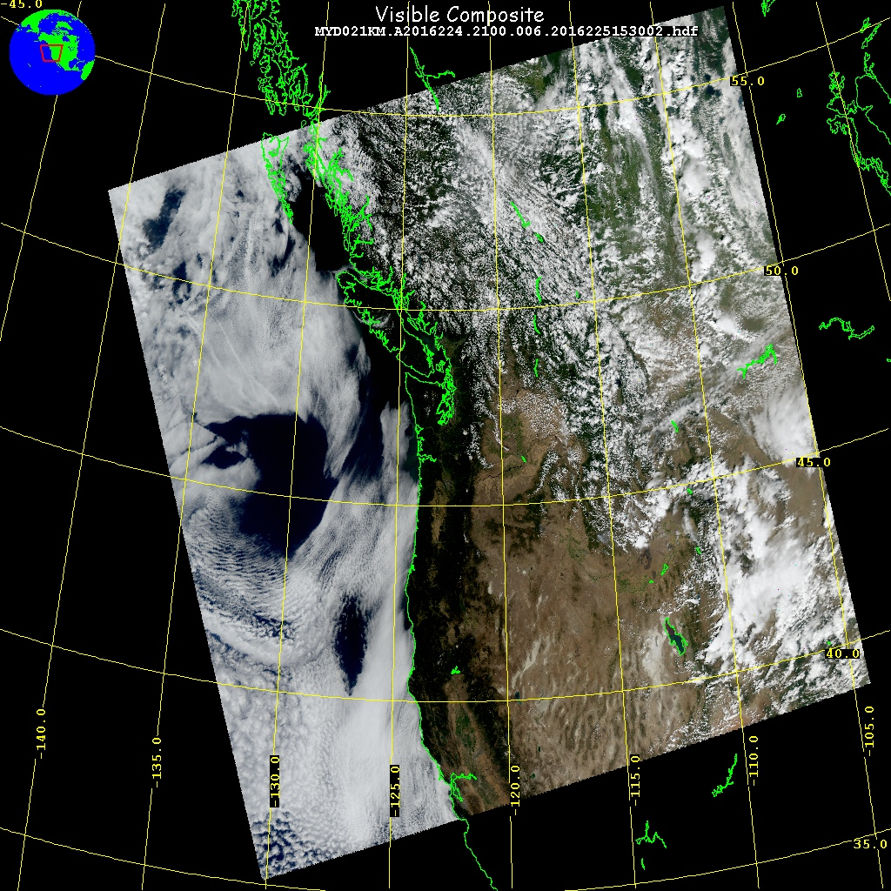

---
jupytext:
  cell_metadata_filter: all
  notebook_metadata_filter: all,-language_info,-toc,-latex_envs
  text_representation:
    extension: .md
    format_name: myst
    format_version: 0.12
    jupytext_version: 1.6.0
kernelspec:
  display_name: Python 3
  language: python
  name: python3
---

(vancouver_visible)=
# NDVI for Vancouver

* One of the most important MODIS level 2 products for land remote sensing is the
  [Normalized difference vegetation index](https://en.wikipedia.org/wiki/Normalized_Difference_Vegetation_Index)

* Visible red (channel 1) and nearir (Channel 2) reflectivities at 250 meter resolution

* Since 250 meter resolution channels are so big, this notebook reads a subset
  of a Vancouver scene.  Channel 1 and Channel 2 are stored as 1 dimensional vectors,
  since all we are doing here is histogramming.  No need for pyresample or lats/lons.

* [Modis channel listing](https://modis.gsfc.nasa.gov/about/specifications.php)

* Band 1 centered at 0.645 microns (red), Band 2 at 0.85 microns (nearir)

* data acquired at 250 m resolution, August 11, 2016

* I've written the measurements between -125 -> -120 deg lon and 45-50 degrees lat to
  an hdf:  vancouver_hires.h5, download in the cell below

* see what the  [ndvi](https://en.wikipedia.org/wiki/Normalized_Difference_Vegetation_Index) histogram looks like at 250 meter resoluiton

```{code-cell}
import numpy as np
import h5py
import sys
import a301_lib
from matplotlib import pyplot as plt
import sat_lib.hdftools.h5dump as h5dump
#
# use hdfview to see the structure of this file
#
filename = a301_lib.sat_data / 'vancouver_hires.h5'
```

```{code-cell}
h5dump.main(filename)
```

Here is the corresponding red,green,blue color composite for the granule.

+++



## Histogram

Now histogram the NDVI for the Vancouver box -- note the range of NDVI -- lots of vegetation (0.8) and some water (less than 0)


```{code-cell}
with h5py.File(filename,'r') as h5_file:
    chan1_refl=h5_file['data_fields']['chan1'][...]
    chan2_refl=h5_file['data_fields']['chan2'][...]
ndvi = (chan2_refl - chan1_refl)/(chan2_refl + chan1_refl)

fig, axis = plt.subplots(1,1,figsize=(10,10))
axis.hist(ndvi)
axis.set(title='ndvi Vancouver');
```
